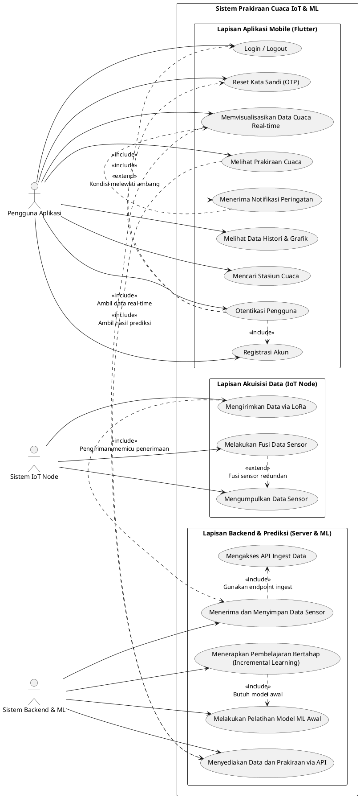

Berikut adalah perbaikan format Markdown dari dokumen tersebut. Saya telah merapikan struktur, tabel, dan blok kode agar siap digunakan sebagai dokumentasi teknis atau disalin ke dalam editor Markdown (seperti Obsidian, VS Code, atau Notion).

---

# Dokumentasi Arsitektur Sistem Prakiraan Cuaca IoT & ML

Dokumen ini mencakup rancangan arsitektur perangkat lunak untuk sistem prakiraan cuaca berbasis IoT, mencakup **Use Case Diagram** dan **Class Diagram** (Konseptual & Detail).

## 1\. Use Case Diagram

Diagram ini mengintegrasikan sensor redundan (DHT22, BMP280, AHT20) dan MCU yang ditingkatkan (Arduino Nano, ESP32-S3), serta mempertahankan komponen *backend* (FastAPI, MySQL) dan *mobile* (Flutter).

### Aktor (Actors)

| Aktor                         | Deskripsi                                                                                                                                                                                          |
| :---------------------------- | :------------------------------------------------------------------------------------------------------------------------------------------------------------------------------------------------- |
| **Pengguna Aplikasi**   | Aktor utama yang menggunakan aplikasi*mobile* Flutter untuk memantau, menganalisis data, dan mendapatkan prakiraan cuaca.                                                                        |
| **Sistem IoT Node**     | Mewakili perangkat keras di lapangan (**Arduino Nano** + Sensor **DHT22, BMP280, AHT20**, dll. + **LoRa Transmitter**) yang bertanggung jawab untuk akuisisi dan transmisi data. |
| **Sistem Backend & ML** | Mewakili*server* dan layanan perangkat lunak (**FastAPI, MySQL, Random Forest Model**) yang menyimpan, memproses, dan menghasilkan prediksi.                                               |

### Skenario Use Case (Fungsi Inti)

#### I. Fungsi Lapisan Akuisisi Data (IoT Node)

*Dijalankan oleh **Sistem IoT Node***

1. **Mengumpulkan Data Sensor**
   * Mengukur parameter cuaca secara *real-time* (Suhu, Kelembapan, Tekanan, Kecepatan Angin, Hujan, Intensitas Cahaya).
2. **Melakukan Fusi Data Sensor** (*\<\<Extend\>\> Mengumpulkan Data Sensor*)
   * Menggabungkan dan memvalidasi pembacaan dari sensor redundan (DHT22, BMP280, AHT20) untuk mendapatkan nilai input yang lebih presisi.
3. **Mengirimkan Data via LoRa**
   * Mentransmisikan paket data yang sudah diproses secara nirkabel dan jarak jauh ke *Gateway* (ESP32-S3).

#### II. Fungsi Lapisan Backend dan Prediksi (Server & ML)

*Dijalankan oleh **Sistem Backend & ML***

1. **Menerima dan Menyimpan Data Sensor** (*\<\<Include\>\> Mengakses API Ingest Data*)
   * Menerima data dari *Gateway* (melalui HTTP POST ke FastAPI) dan menyimpannya ke **MySQL**.
2. **Melakukan Pelatihan Model ML Awal**
   * Melatih model **Random Forest Regressor** menggunakan data historis.
3. **Menerapkan Pembelajaran Bertahap (*Incremental Learning*)**
   * Melatih ulang model secara berkelanjutan dengan data *real-time* yang baru di-ingest untuk meningkatkan akurasi dari waktu ke waktu.
4. **Menyediakan Data dan Prakiraan via API**
   * Menawarkan API *endpoint* (FastAPI) untuk data *real-time*, historis, dan hasil prediksi ke aplikasi *mobile*.

#### III. Fungsi Lapisan Aplikasi Mobile (Pengguna dengan Login)

*Diakses oleh **Pengguna Aplikasi***

1. **Otentikasi Pengguna**
   * Registrasi Akun, Login/Logout, Reset Kata Sandi (via OTP).
2. **Memvisualisasikan Data Cuaca *Real-time*** (*\<\<Include\>\> Menyediakan Data dan Prakiraan via API*)
   * Menampilkan kondisi cuaca terkini (Suhu, Kelembapan, Angin, dll.) dalam format tabular dan ringkasan.
3. **Melihat Data Histori & Grafik**
   * Menampilkan data masa lalu dalam format grafis (*line chart*) untuk analisis tren.
4. **Melihat Prakiraan Cuaca** (*\<\<Include\>\> Menyediakan Data dan Prakiraan via API*)
   * Mengambil dan menampilkan hasil prediksi model Random Forest Regressor.
5. **Menerima Notifikasi Peringatan** (*\<\<Extend\>\> Memvisualisasikan Data Cuaca Real-time*)
   * Aplikasi mengirimkan notifikasi ketika parameter cuaca melebihi ambang batas yang telah ditentukan.
6. **Mencari Stasiun Cuaca**
   * Mengizinkan pengguna mencari dan memilih stasiun cuaca yang relevan.

### Kode Diagram (PlantUML)

---

## 2\. Class Diagram Konseptual (High-Level)

Diagram ini membagi sistem menjadi empat lapisan logis utama: Akuisisi Data, *Middleware* Data, Model Prediksi, dan Antarmuka Pengguna. Diagram ini bersifat **Architectural / High-Level**, berfokus pada struktur modul dan entitas bisnis utama.

### Definisi Kelas Utama

#### I. Lapisan Akuisisi Data (IoT/Transmitter)

| Kelas                    | Atribut Kunci                             | Tanggung Jawab Utama                                                |
| :----------------------- | :---------------------------------------- | :------------------------------------------------------------------ |
| **WeatherStation** | `StationID`, `LocationID`             | Merepresentasikan lokasi fisik stasiun.                             |
| **IoTNode**        | `NodeID`, `HardwareMCU`               | Mengumpulkan data sensor, menjalankan*firmware*.                  |
| **SensorData**     | `DataID`, `Temperature`, `Humidity` | Menyimpan pembacaan mentah/fusi parameter cuaca.                    |
| **Sensor**         | `SensorType`, `HardwareID`            | Memberikan data resolusi tinggi (Redundansi: DHT22, BMP280, AHT20). |
| **Gateway**        | `GatewayID`, `WiFiStatus`             | Menerima paket LoRa dan meneruskannya ke*server*.                 |

#### II. Lapisan Middleware Data (Backend)

| Kelas              | Atribut Kunci           | Tanggung Jawab Utama                                         |
| :----------------- | :---------------------- | :----------------------------------------------------------- |
| **Database** | `Type` (MySQL)        | Menyimpan data sensor*real-time* dan historis.             |
| **API**      | `Framework` (FastAPI) | Menyediakan layanan data (Ingest & Retrieve) dan otentikasi. |
| **User**     | `UserID`, `Role`    | Mengelola otentikasi dan profil pengguna.                    |

#### III. Lapisan Model Prediksi (Machine Learning)

| Kelas              | Atribut Kunci                     | Tanggung Jawab Utama                                                   |
| :----------------- | :-------------------------------- | :--------------------------------------------------------------------- |
| **MLModel**  | `Algorithm` (RandomForest)      | Melatih model secara bertahap (*Incremental Learning*) dan prediksi. |
| **Forecast** | `ForecastID`, `PredictedTemp` | Menyimpan data hasil prakiraan.                                        |

#### IV. Lapisan Antarmuka Pengguna

| Kelas                       | Atribut Kunci              | Tanggung Jawab Utama                       |
| :-------------------------- | :------------------------- | :----------------------------------------- |
| **MobileApplication** | `Platform` (Flutter)     | Menampilkan data dan grafik ke pengguna.   |
| **AlertNotification** | `AlertID`, `Threshold` | Memicu notifikasi peringatan*real-time*. |
