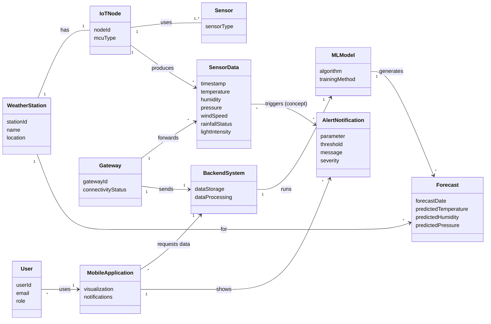

```mermaid
classDiagram
direction LR

class WeatherStation {
  stationId
  name
  location
}

class IoTNode {
  nodeId
  mcuType
}

class Sensor {
  sensorType
}

class SensorData {
  timestamp
  temperature
  humidity
  pressure
  windSpeed
  rainfallStatus
  lightIntensity
}

class Gateway {
  gatewayId
  connectivityStatus
}

class BackendSystem {
  dataStorage
  dataProcessing
}

class MLModel {
  algorithm
  trainingMethod
}

class Forecast {
  forecastDate
  predictedTemperature
  predictedHumidity
  predictedPressure
}

class MobileApplication {
  visualization
  notifications
}

class User {
  userId
  email
  role
}

class AlertNotification {
  parameter
  threshold
  message
  severity
}

%% High-level relationships
WeatherStation "1" -- "1" IoTNode : has
IoTNode "1" -- "1..*" Sensor : uses
IoTNode "1" --> "*" SensorData : produces
Gateway "1" --> "*" SensorData : forwards
Gateway "1" --> "1" BackendSystem : sends
BackendSystem "1" --> "1" MLModel : runs
MLModel "1" --> "*" Forecast : generates
WeatherStation "1" --> "*" Forecast : for
MobileApplication "*" --> "1" BackendSystem : requests data
User "*" --> "1" MobileApplication : uses
MobileApplication "1" --> "*" AlertNotification : shows
SensorData "*" --> "*" AlertNotification : triggers (concept)

```