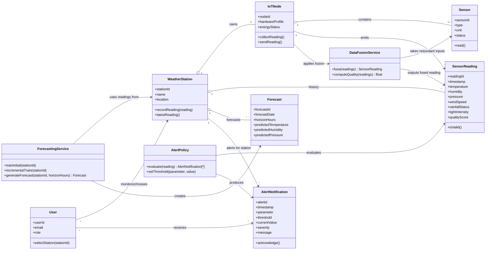

```mermaid
classDiagram
direction LR

%% ==========================
%% AGGREGATES / ENTITIES
%% ==========================

class WeatherStation {
  +stationId
  +name
  +location

  +recordReading(reading)
  +latestReading()
}

class IoTNode {
  +nodeId
  +hardwareProfile
  +energyStatus

  +collectReading()
  +sendReading()
}

class Sensor {
  +sensorId
  +type
  +unit
  +status

  +read()
}

class SensorReading {
  +readingId
  +timestamp
  +temperature
  +humidity
  +pressure
  +windSpeed
  +rainfallStatus
  +lightIntensity
  +qualityScore

  +isValid()
}

class Forecast {
  +forecastId
  +forecastDate
  +horizonHours
  +predictedTemperature
  +predictedHumidity
  +predictedPressure
}

class User {
  +userId
  +email
  +role

  +selectStation(stationId)
}

class AlertNotification {
  +alertId
  +timestamp
  +parameter
  +threshold
  +currentValue
  +severity
  +message

  +acknowledge()
}

%% ==========================
%% DOMAIN SERVICES / POLICIES
%% ==========================

class DataFusionService {
  +fuse(readings) SensorReading
  +computeQuality(readings) float
}

class ForecastingService {
  +trainInitial(stationId)
  +incrementalTrain(stationId)
  +generateForecast(stationId, horizonHours) Forecast
}

class AlertPolicy {
  +evaluate(reading) AlertNotification[*]
  +setThreshold(parameter, value)
}

%% ==========================
%% RELATIONSHIPS (Business)
%% ==========================

%% Aggregate root: WeatherStation
WeatherStation "1" o-- "1" IoTNode : owns
IoTNode "1" o-- "1..*" Sensor : contains

WeatherStation "1" o-- "*" SensorReading : history
IoTNode "1" --> "*" SensorReading : emits

WeatherStation "1" o-- "*" Forecast : forecasts
ForecastingService --> WeatherStation : uses readings from
ForecastingService --> Forecast : creates

DataFusionService --> Sensor : takes redundant inputs
DataFusionService --> SensorReading : outputs fused reading
IoTNode --> DataFusionService : applies fusion

AlertPolicy --> SensorReading : evaluates
AlertPolicy --> AlertNotification : produces
WeatherStation "1" --> "*" AlertNotification : alerts for station

User "*" --> "*" WeatherStation : monitors/chooses
User "*" --> "*" AlertNotification : receives

```