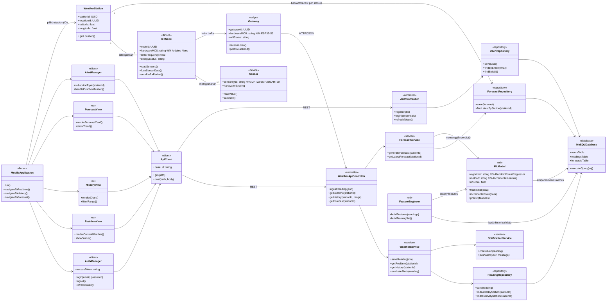

Berikut **architecture class diagram** untuk sistem prakiraan cuaca IoT & ML-mu dalam format **Mermaid** (fokus ke komponen arsitektur: device, backend, ML, dan mobile app).

Kalau mau, nanti kita bisa buat versi “disederhanakan” (lebih sedikit kelas) khusus untuk dimasukkan ke laporan/skripsi, dan versi lengkap (seperti di atas) untuk dokumentasi teknis internal.