Berikut **detailed class diagram** (atribut + method + tipe lengkap) untuk sistem prakiraan cuaca IoT & ML dengan **backend Python (FastAPI + SQLAlchemy + Pydantic + MySQL)**. Aku buat menyeluruh untuk backend, plus kelas inti yang berinteraksi lintas layer (station, reading, forecast, alert, ML). Ini diagram konseptual tapi sudah “Pythonic”.

```mermaid
classDiagram
direction LR

%% =====================================================
%% COMMON / DOMAIN ENTITIES  (SQLAlchemy ORM Models)
%% =====================================================

class User {
  <<entity>>
  +id: UUID
  +email: str
  +password_hash: str
  +role: str
  +is_active: bool
  +created_at: datetime
  +updated_at: datetime

  +verify_password(plain: str, hasher: PasswordHasher): bool
  +set_password(plain: str, hasher: PasswordHasher): None
}

class WeatherStation {
  <<entity>>
  +id: UUID
  +name: str
  +location_id: str
  +latitude: float
  +longitude: float
  +description: str
  +is_active: bool
  +created_at: datetime
  +updated_at: datetime

  +to_dict(): dict[str, object]
}

class IoTNode {
  <<entity>>
  +id: UUID
  +station_id: UUID
  +hardware_mcu: str  %% Arduino Nano
  +lora_frequency_hz: int
  +energy_status: str
  +firmware_version: str
  +last_seen: datetime

  +mark_seen(ts: datetime): None
}

class Sensor {
  <<entity>>
  +id: UUID
  +node_id: UUID
  +sensor_type: str  %% DHT22/BMP280/AHT20
  +hardware_id: str
  +unit: str
  +calibration_offset: float
  +is_active: bool

  +apply_calibration(raw_value: float): float
}

class SensorReading {
  <<entity>>
  +id: UUID
  +station_id: UUID
  +node_id: UUID
  +timestamp: datetime
  +temperature_c: float
  +humidity_pct: float
  +pressure_hpa: float
  +wind_speed_ms: float
  +rainfall_status: bool
  +light_intensity_lux: float
  +source_sensors: list[str]  %% redundan/fusi
  +quality_score: float

  +validate_ranges(): bool
  +to_features(): list[float]
}

class Forecast {
  <<entity>>
  +id: UUID
  +station_id: UUID
  +forecast_date: date
  +horizon_hours: int
  +predicted_temp_c: float
  +predicted_humidity_pct: float
  +predicted_pressure_hpa: float
  +model_version: str
  +created_at: datetime

  +to_dict(): dict[str, object]
}

class AlertNotification {
  <<entity>>
  +id: UUID
  +station_id: UUID
  +timestamp: datetime
  +parameter: str
  +threshold: float
  +current_value: float
  +message: str
  +severity: str  %% INFO/WARN/CRITICAL
  +is_sent: bool

  +format_message(): str
}


%% =====================================================
%% Pydantic Schemas (DTOs)
%% =====================================================

class UserCreateDTO {
  <<schema>>
  +email: EmailStr
  +password: str
  +role: str
}

class UserLoginDTO {
  <<schema>>
  +email: EmailStr
  +password: str
}

class TokenDTO {
  <<schema>>
  +access_token: str
  +token_type: str
  +expires_in: int
}

class StationCreateDTO {
  <<schema>>
  +name: str
  +location_id: str
  +latitude: float
  +longitude: float
  +description: str
}

class ReadingIngestDTO {
  <<schema>>
  +station_id: UUID
  +node_id: UUID
  +timestamp: datetime
  +temperature_c: float
  +humidity_pct: float
  +pressure_hpa: float
  +wind_speed_ms: float
  +rainfall_status: bool
  +light_intensity_lux: float
  +source_sensors: list[str]
}

class ReadingOutDTO {
  <<schema>>
  +id: UUID
  +station_id: UUID
  +timestamp: datetime
  +temperature_c: float
  +humidity_pct: float
  +pressure_hpa: float
  +wind_speed_ms: float
  +rainfall_status: bool
  +light_intensity_lux: float
  +quality_score: float
}

class ForecastOutDTO {
  <<schema>>
  +id: UUID
  +station_id: UUID
  +forecast_date: date
  +horizon_hours: int
  +predicted_temp_c: float
  +predicted_humidity_pct: float
  +predicted_pressure_hpa: float
  +model_version: str
}

class AlertOutDTO {
  <<schema>>
  +id: UUID
  +station_id: UUID
  +timestamp: datetime
  +parameter: str
  +threshold: float
  +current_value: float
  +message: str
  +severity: str
}

%% =====================================================
%% Infrastructure / Security
%% =====================================================

class DBSessionManager {
  <<infrastructure>>
  +engine: Engine
  +session_factory: sessionmaker

  +get_session(): Session
  +health_check(): bool
}

class PasswordHasher {
  <<security>>
  +scheme: str
  +rounds: int

  +hash_password(plain: str): str
  +verify(plain: str, hashed: str): bool
}

class JWTManager {
  <<security>>
  +secret_key: str
  +algorithm: str
  +access_ttl_minutes: int

  +create_access_token(user_id: UUID, role: str): str
  +decode_token(token: str): dict[str, object]
  +is_token_valid(token: str): bool
}

%% =====================================================
%% Repositories / DAOs
%% =====================================================

class UserRepository {
  <<repository>>
  -db: Session

  +create(dto: UserCreateDTO): User
  +find_by_email(email: str): User|None
  +find_by_id(user_id: UUID): User|None
  +set_active(user_id: UUID, active: bool): None
}

class StationRepository {
  <<repository>>
  -db: Session

  +create(dto: StationCreateDTO): WeatherStation
  +find_by_id(station_id: UUID): WeatherStation|None
  +find_all(active_only: bool=True): list[WeatherStation]
  +delete(station_id: UUID): None
}

class NodeRepository {
  <<repository>>
  -db: Session

  +find_by_id(node_id: UUID): IoTNode|None
  +update_last_seen(node_id: UUID, ts: datetime): None
}

class SensorRepository {
  <<repository>>
  -db: Session

  +find_by_node(node_id: UUID): list[Sensor]
  +find_active_by_node(node_id: UUID): list[Sensor]
}

class ReadingRepository {
  <<repository>>
  -db: Session

  +save(reading: SensorReading): SensorReading
  +find_latest(station_id: UUID): SensorReading|None
  +find_history(station_id: UUID, start: datetime, end: datetime): list[SensorReading]
  +count_for_training(station_id: UUID): int
}

class ForecastRepository {
  <<repository>>
  -db: Session

  +save(forecast: Forecast): Forecast
  +find_latest(station_id: UUID): Forecast|None
  +find_by_date(station_id: UUID, date_: date): list[Forecast]
}

class AlertRepository {
  <<repository>>
  -db: Session

  +save(alert: AlertNotification): AlertNotification
  +find_unsent(): list[AlertNotification]
  +mark_sent(alert_id: UUID): None
}

%% =====================================================
%% Services (Business Logic)
%% =====================================================

class AuthService {
  <<service>>
  -users: UserRepository
  -hasher: PasswordHasher
  -jwt: JWTManager

  +register(dto: UserCreateDTO): User
  +login(dto: UserLoginDTO): TokenDTO
  +validate_user(email: str, password: str): User|None
}

class StationService {
  <<service>>
  -stations: StationRepository

  +create_station(dto: StationCreateDTO): WeatherStation
  +get_station(station_id: UUID): WeatherStation
  +list_stations(active_only: bool=True): list[WeatherStation]
}

class ReadingService {
  <<service>>
  -readings: ReadingRepository
  -nodes: NodeRepository
  -stations: StationRepository
  -notifier: NotificationService
  -ml: MLService

  +ingest(dto: ReadingIngestDTO): ReadingOutDTO
  +get_realtime(station_id: UUID): ReadingOutDTO
  +get_history(station_id: UUID, start: datetime, end: datetime): list[ReadingOutDTO]
  +compute_quality(dto: ReadingIngestDTO): float
}

class NotificationService {
  <<service>>
  -alerts: AlertRepository

  +evaluate_thresholds(reading: SensorReading): list[AlertNotification]
  +push_alert(alert: AlertNotification, users: list[User]): None
}

class MLService {
  <<service>>
  -model: RandomForestModel
  -readings: ReadingRepository
  -forecasts: ForecastRepository
  -feature_engineer: FeatureEngineer

  +train_initial(station_id: UUID): str  %% returns model_version
  +incremental_train(station_id: UUID): str
  +predict_next(station_id: UUID, horizon_hours: int=24): ForecastOutDTO
}

%% =====================================================
%% ML Engine Components (Python)
%% =====================================================

class FeatureEngineer {
  <<ml>>
  +window_size: int
  +feature_names: list[str]

  +build_features(readings: list[SensorReading]): list[list[float]]
  +build_labels(readings: list[SensorReading]): list[list[float]]
  +latest_feature_vector(reading: SensorReading): list[float]
}

class RandomForestModel {
  <<ml>>
  +n_estimators: int
  +max_depth: int|None
  +model_version: str
  +r2_score: float

  +fit(X: list[list[float]], y: list[list[float]]): None
  +partial_fit(X: list[list[float]], y: list[list[float]]): None
  +predict(X: list[list[float]]): list[list[float]]
  +save(path: str): None
  +load(path: str): RandomForestModel
}

%% =====================================================
%% FastAPI Routers / Controllers
%% =====================================================

class AuthRouter {
  <<router>>
  +router: APIRouter

  +register(dto: UserCreateDTO): User
  +login(dto: UserLoginDTO): TokenDTO
  +me(current_user: User): User
}

class StationRouter {
  <<router>>
  +router: APIRouter

  +create(dto: StationCreateDTO, admin: User): WeatherStation
  +get(station_id: UUID): WeatherStation
  +list(): list[WeatherStation]
}

class ReadingRouter {
  <<router>>
  +router: APIRouter

  +ingest(dto: ReadingIngestDTO): ReadingOutDTO
  +realtime(station_id: UUID): ReadingOutDTO
  +history(station_id: UUID, start: datetime, end: datetime): list[ReadingOutDTO]
}

class ForecastRouter {
  <<router>>
  +router: APIRouter

  +latest(station_id: UUID): ForecastOutDTO
  +by_date(station_id: UUID, date_: date): list[ForecastOutDTO]
  +retrain(station_id: UUID, admin: User): dict[str, str]
}

%% =====================================================
%% RELATIONSHIPS / MULTIPLICITIES
%% =====================================================

WeatherStation "1" -- "1" IoTNode : has_node
IoTNode "1" -- "1..*" Sensor : uses
WeatherStation "1" -- "*" SensorReading : produces
IoTNode "1" -- "*" SensorReading : emits
WeatherStation "1" -- "*" Forecast : has_forecasts
WeatherStation "1" -- "*" AlertNotification : triggers

AuthRouter --> AuthService
StationRouter --> StationService
ReadingRouter --> ReadingService
ForecastRouter --> MLService
ForecastRouter --> ForecastRepository

AuthService --> UserRepository
AuthService --> PasswordHasher
AuthService --> JWTManager

StationService --> StationRepository

ReadingService --> ReadingRepository
ReadingService --> NodeRepository
ReadingService --> StationRepository
ReadingService --> NotificationService
ReadingService --> MLService

NotificationService --> AlertRepository

MLService --> RandomForestModel
MLService --> FeatureEngineer
MLService --> ReadingRepository
MLService --> ForecastRepository

UserRepository --> DBSessionManager
StationRepository --> DBSessionManager
NodeRepository --> DBSessionManager
SensorRepository --> DBSessionManager
ReadingRepository --> DBSessionManager
ForecastRepository --> DBSessionManager
AlertRepository --> DBSessionManager

UserCreateDTO ..> User : maps_to
UserLoginDTO ..> User : authenticates
ReadingIngestDTO ..> SensorReading : maps_to
ForecastOutDTO ..> Forecast : maps_to
AlertOutDTO ..> AlertNotification : maps_to
```

Catatan singkat asumsi yang kupakai (biar nyambung ke implementasi Python-mu):

* ORM: **SQLAlchemy** (kelas `<<entity>>`)
* DTO/schema: **Pydantic** (kelas `<<schema>>`)
* Router: **FastAPI APIRouter** (kelas `<<router>>`)
* ML: wrapper Python untuk RandomForest + incremental retraining (kelas `<<ml>>`)

Kalau kamu mau, aku bisa turunkan ini jadi **kode skeleton FastAPI** (models, schemas, routers, services, repos) yang 1:1 sesuai diagram.
