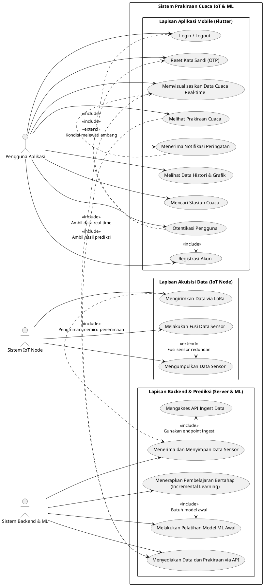

```plantuml
@startuml
left to right direction
skinparam packageStyle rectangle

actor "Pengguna Aplikasi" as User
actor "Sistem IoT Node" as IoT
actor "Sistem Backend & ML" as Backend

rectangle "Sistem Prakiraan Cuaca IoT & ML" as System {

  ' ================================
  ' Lapisan Akuisisi Data (IoT Node)
  ' ================================
  package "Lapisan Akuisisi Data (IoT Node)" {
    usecase "Mengumpulkan Data Sensor" as UC_Collect
    usecase "Melakukan Fusi Data Sensor" as UC_Fusion
    usecase "Mengirimkan Data via LoRa" as UC_LoRa
  }

  ' ==========================================
  ' Lapisan Backend & Prediksi (Server & ML)
  ' ==========================================
  package "Lapisan Backend & Prediksi (Server & ML)" {
    usecase "Menerima dan Menyimpan Data Sensor" as UC_ReceiveStore
    usecase "Mengakses API Ingest Data" as UC_IngestAPI
    usecase "Melakukan Pelatihan Model ML Awal" as UC_TrainInitial
    usecase "Menerapkan Pembelajaran Bertahap\n(Incremental Learning)" as UC_Incremental
    usecase "Menyediakan Data dan Prakiraan via API" as UC_ProvideAPI
  }

  ' =================================
  ' Lapisan Aplikasi Mobile (Flutter)
  ' =================================
  package "Lapisan Aplikasi Mobile (Flutter)" {
    usecase "Otentikasi Pengguna" as UC_Auth
    usecase "Registrasi Akun" as UC_Register
    usecase "Login / Logout" as UC_LoginLogout
    usecase "Reset Kata Sandi (OTP)" as UC_ResetPwd

    usecase "Memvisualisasikan Data Cuaca\nReal-time" as UC_VisualRT
    usecase "Melihat Data Histori & Grafik" as UC_History
    usecase "Melihat Prakiraan Cuaca" as UC_Forecast
    usecase "Menerima Notifikasi Peringatan" as UC_Notify
    usecase "Mencari Stasiun Cuaca" as UC_SearchStation
  }

}

' ===========================
' Asosiasi Aktor -> Use Case
' ===========================

' Sistem IoT Node
IoT --> UC_Collect
IoT --> UC_Fusion
IoT --> UC_LoRa

' Sistem Backend & ML
Backend --> UC_ReceiveStore
Backend --> UC_TrainInitial
Backend --> UC_Incremental
Backend --> UC_ProvideAPI

' Pengguna Aplikasi
User --> UC_Auth
User --> UC_VisualRT
User --> UC_History
User --> UC_Forecast
User --> UC_Notify
User --> UC_SearchStation

' Opsional: pengguna juga langsung berinteraksi dengan sub-use case otentikasi
User --> UC_Register
User --> UC_LoginLogout
User --> UC_ResetPwd

' ===========================
' Relasi Include / Extend
' ===========================

' IoT Node layer
UC_Fusion .> UC_Collect : <<extend>>\nFusi sensor redundan
UC_LoRa .> UC_ReceiveStore : <<include>>\nPengiriman memicu penerimaan

' Backend & ML layer
UC_ReceiveStore .> UC_IngestAPI : <<include>>\nGunakan endpoint ingest
UC_Incremental .> UC_TrainInitial : <<include>>\nButuh model awal

' Mobile layer – otentikasi
UC_Auth .> UC_Register : <<include>>
UC_Auth .> UC_LoginLogout : <<include>>
UC_Auth .> UC_ResetPwd : <<include>>

' Mobile layer – data & prediksi
UC_VisualRT .> UC_ProvideAPI : <<include>>\nAmbil data real-time
UC_Forecast .> UC_ProvideAPI : <<include>>\nAmbil hasil prediksi
UC_Notify .> UC_VisualRT : <<extend>>\nKondisi melewati ambang

@enduml
```
